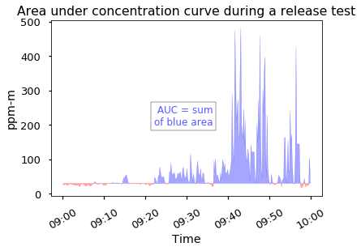
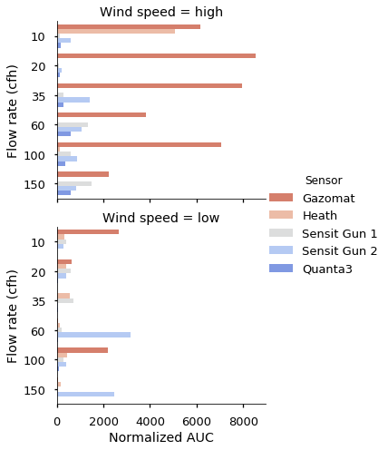

# GTI Stationary methane sensor project

Project completed under the Operations Technology Development branch of [Gas Technology Institute](hhttps://www.gti.energy/). The title of the project is "Evaluation of Stationary Continuous Methane Monitoring System". The data analysis involves processing one year worth of sensor time series data (data collection rate of 6 sec) for multiple sensors and comparing their perfrormances.

### Objective 
The objective of this project is to evaluate, and field demonstrate new and advanced stationary continuous methane monitoring systems for potential use at natural gas facilities. 

### Background

Many different types of methane sensors are available for natural gas leak detection but recently new stationary continuous methane sensors have emerged boasting higher sensitivity and larger coverage (i.e longer range for ranged systems).

Four stationary sensor technologies were selected for evaluation. Two of the sensors (Sensit and Heath) were ranged open-path sensors which continuously shoots a beam of infrared laser and interrogates methane concentration along its path. One sensor (Quanta3) was an insitu point sensor which requires emissions to drift into its cavity for detection making it extremely reliant on wind direction. The last sensor (Gazomat) was a point sensor with a pump connected to a set of sampling lines that draw air directly in from the station.

The 4 selected technologies were installed at a metering and regulation station at a host utility company with the following configuration. The two parallel cylindrical stuctures in the bright red box are the assets that could potentially emit natural gas. They consist of valves, regulators, flanges, sensing lines, among other components.

### Protocol

Controlled release tests were also performed at the station to test the sensors' ability to detect natural gas emissions. A manifold with orifices of different sizes and shut-off valves were built at the site to control the release rate. During every controlled release, the following protocol was used. 

A total of 5 controlled release tests were performed over the course of the test duration (one year). Here is a summary of the meteorological and release conditions during the controlled releases:

Wind direction and speed play an important role in the sensor's ability to detect emissions. We can categorize speed and direction into two buckets respectively:  

### Performance metric

To assess performance of the multiple sensors, we need to define a quantifiable metric. We selected number of indications and the area under the concentration curve to determine if the sensor identified the emissions during a release test. If a gas was being released and the sensor was downwind of the gas source, the sensor is expected to detect the emissions. 

An **indication** is defined as a 2-minute period when at least one reading is above 2x background level. **Area under curve** (AUC) is the sum of area under the curve that are above the background level. Here are illustrations of how the number of indications and area under the curve (AUC) can be quantified:

	
	

### Results

The cumulative number of indications and AUC values were calculated for each sensor for all the controlled release and shown below:

The number of indications produced at varying flow rates can be visualized. There is not a a lot of difference across flowrates as the sensors were capable of producing indications across the range of flow rates. 

The number of indications can be further broken down by wind speed and direction categories. It can be observed that Southerly wind directions and high wind speed promote better detection by sensors. This makes sense as the sensors are positioned north of the station and stronger wind would advect gas towards the sensor. 

	
	

Based on the bar charts, we can observe that in situ point sensors are more dependent on wind direction than ranged sensors which constantly interrogates the methane concentration along its laser path.

The correlation between number of indications and wind speed can also be plotted for each sensor. In situ point sensors are more dependent on wind speed than ranged sensors.

Similar to the set of charts above, the relationship between AUC scores at varying flow rates can be visualized:

The impact of wind speed and direction on AUC can be explored in the following charts:

	
	

And then the relationship between AUC scores and wind speed can be plotted for each sensor:

Another area we can examine is how well each sensor correlates with one another. The number of indications and AUC scores can be compared among sensors using the pairplot function from the *seaborn* library in Python. There is generally a positive correlation between the sensors.

In summary, the controlled release tests highlighted the exceptional abilities of all the sensors to reliably detect leaks larger than 10 cfh.

### Sensor performance outside of the controlled release tests

The sensors' monthly uptime and number of indications **outside of the controlled release tests** were plotted below. Uptime percentage is a measure of how stable the system is; any downtime due to network or power issues, or readings that are significantly below normal background methane level would result in a penalty to the system uptime percentage. Quanta3 and Gazomat did not have system uptime data after February as both systems were taken out of operation in February.  

### Credits
The study and report was completed by Gerry Bong, Chris Ziolkowski, and Susan Stuver. 